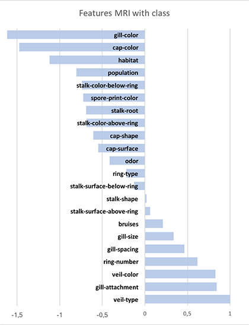

Entropy
=======
Small set of utilities to compute entropy related measures over DataFrames in Spark.

To use the library, simply, 

  1. Clone this repo.
  2. build the jar: `sbt assembly`
  3. add the JAR to Spark parameters (`$SPARK_HOME/bin/spark-shell --jars $MYJAR`),
  4. launch Spark

and from there:

```scala
import org.renero
val H = new Entropy(spark, myDataFrame)
    
// To compute the entropy of a given column: H(X)
H.entropy("columnName")
    
// To compute the conditional entropy of two columns, H(Y|X)
H.conditionalEntropy("YcolumnName", "XcolumnName")
    
// To compute the mutual relative information of mRI(Y|X)
H.mRI("YcolumnName", "XcolumnName")
```
    
and that's it.
The **entropy** $H(U)$ quantifies the uncertainty about an observation.

The **conditional entropy** $H(U|F_i)$ quantifies the remaining
uncertainty if the value of feature i is known. 

The difference of $H(U)$ and $H(U|F_i)$ becomes maximal if the feature ($F_i$) fully determines the observation ($U$). Mutual Relative Information is computed using the expression:

\begin{equation}
1 - \frac{(H(Y|X)}{H(X)}
\end{equation}


## Validation

The example used to validate the computations come from the fantastic video lecture by Unversity of Washington (https://www.youtube.com/watch?v=sGP1lCAJ-_g). This example is based on the following table:
	
	+--------+-----------+--------+-----+----+
	| outlook|temperature|humidity|windy|play|
	+--------+-----------+--------+-----+----+
	|overcast|       cool|     0.5|    1|   1|
	|overcast|        hot|     0.9|    1|   1|
	|overcast|        hot|     0.5|    1|   1|
	|overcast|       mild|     0.9|    1|   1|
	|   rainy|       cool|     0.5|    0|   0|
	|   rainy|       mild|     0.9|    0|   0|
	|   rainy|       cool|     0.5|    1|   1|
	|   rainy|       mild|     0.9|    1|   1|
	|   rainy|       mild|     0.5|    1|   1|
	|   sunny|        hot|     0.9|    0|   0|
	|   sunny|        hot|     0.9|    0|   0|
	|   sunny|       mild|     0.9|    0|   0|
	|   sunny|       cool|     0.5|    1|   1|
	|   sunny|       mild|     0.5|    1|   1|
	+--------+-----------+--------+-----+----+

where we want to predict the feature "play". The goal is to determine what is the mutual information between the different features or predictors in table and the dependent variable ("play"). The example has been slightly modified to illustrate that the feature "windy" absolutely determines the feature "play", as they share the same values.

To get this table in your spark console:

```scala
val outlook = List("overcast","overcast","overcast","overcast","rainy","rainy","rainy","rainy","rainy","sunny","sunny","sunny","sunny","sunny")
val temp = List("cool","hot","hot","mild","cool","mild","cool","mild","mild","hot","hot","mild","cool","mild")
val hum = List(0.5,0.9,0.5,0.9,0.5,0.9,0.5,0.9,0.5,0.9,0.9,0.9,0.5,0.5)
val windy = List(1,1,1,1,0, 0, 1,1,1,0,0,0,1, 1)
val play  = List(1,1,1,1,0, 0, 1,1,1,0,0,0,1, 1)
val table = sc.parallelize(outlook.zip(temp).zip(hum).zip(wind**y).zip(play).map {
  case ((((col1, col2), col3), col4), col5) => (col1,col2,col3,col4,col5)
}).toDF("outlook","temperature","humidity","windy","play")
```

The result:

```scala
scala> H.entropy("play")
res0: Double = 0.9402859586706309
    
scala> H.conditionalEntropy("play", "outlook")
res1: Double = 1.330656463077906
    
scala> H.mRI("play", "outlook")
res2: Double = -0.4151614738129006
```

## Disclaimer

This is the result of a one-shot. The code to extract partial values from a DataFrame is ... well... I don't like it, though it works. Any suggestion is welcome to continue improving this.

Need tro check the relationship between MRI and feature importance, as computed in [this example from kaggle](https://www.kaggle.com/monkeydunkey/d/uciml/mushroom-classification/a-comparison-of-few-ml-models).

The MRI values are like

<center>

</center>
 
and the feature importance is:

<center>

</center>
